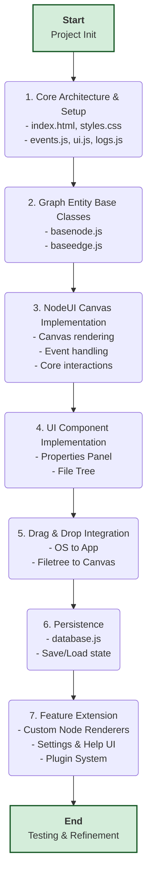

# NodeUI

`NodeUI` is a modular, event-driven, node-based UI application built with vanilla JavaScript, inspired by the concepts of `JSONCanvas` and `Obsidian`. The application's core principle is that all nodes are fundamentally markdown renderers, with a node's `type` determining how its content is visually presented. This flexible architecture ensures the app is highly extensible and customizable.

## Architecture

The application is built on a decoupled Publish/Subscribe (Pub/Sub) event bus (`js/events.js`). This allows components to communicate without direct dependencies, making the system scalable, maintainable, and easy to debug. All major components (`nodeui`, `properties`, etc.) interact through this bus.

## Key Features

*   **Dynamic Node Rendering**: Nodes render content based on their type.
*   **Event-Driven**: Decoupled architecture using a Pub/Sub event bus.
*   **Interactive Canvas**:
    *   Create, edit, and delete nodes and edges.
    *   Pan and zoom with mouse and touch support.
    *   Drag-and-drop node repositioning.
    *   Multi-selection of nodes and edges.
    *   Right-click/long-press context menus.
*   **Advanced Edge Handling**:
    *   "Cut edge" mode to quickly delete connections.
    *   Insert routing nodes into edges by double-clicking.
*   **Snapping System**:
    *   Snap to grid.
    *   Snap to objects (alignment guides).
*   **Responsive Design**: Mobile-first and touch-friendly interface.
*   **Modern Look & Feel**: Sleek, dark mode theme with green accents, inspired by Supabase.

## Tech Stack

*   **Frontend**: Vanilla JavaScript (ES6+), HTML5, CSS3
*   **Icons**: Lucide Icons

## Project Structure

```
/
├── index.html               # Main page
├── styles.css               # All styles (dark mode + green accent)
├── README.md                # Project README
js/                          # Core application logic
├── events.js                # Central event bus (Pub/Sub)
├── ui.js                    # UI utility functions
├── nodeui.js                # Core UI and canvas logic
├── properties.js            # Properties UI for nodes and edges
├── contextmenu.js           # Context menu handler
├── logs.js                  # Debug logging service
└── graph/                   # Graph entity base classes
    ├── basenode.js          # Base class for all node types
    ├── baseedge.js          # Base class for all edge types
    ├── routingnode.js       # Specialized node for edge routing
    └── groupnode.js         # Specialized node for grouping other nodes
```

## Getting Started

Since this is a client-side application with no build step, you can run it directly in your browser.

1.  Clone the repository:
    ```sh
    git clone https://github.com/your-username/nodeui2.git
    ```
2.  Open the `index.html` file in your web browser. A live server is recommended for development to avoid potential CORS issues with local file access.

## Development Workflow

The project follows a structured, checkpoint-based workflow. Development proceeds in stages, from core architecture to UI components, persistence, and feature extensions. This ensures a clean, atomic commit history.

