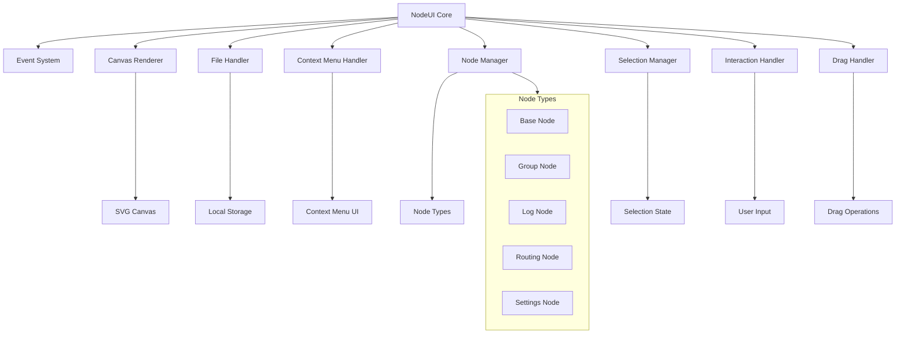
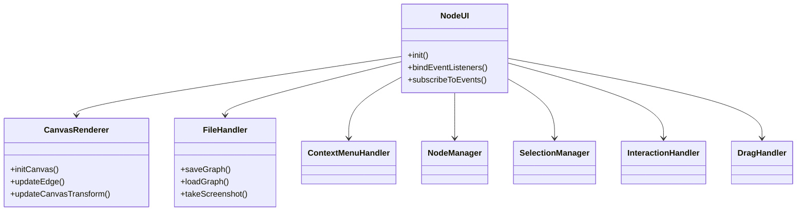
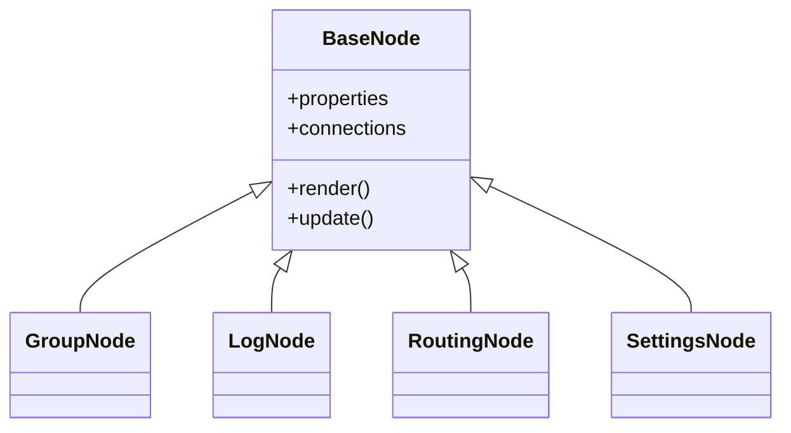
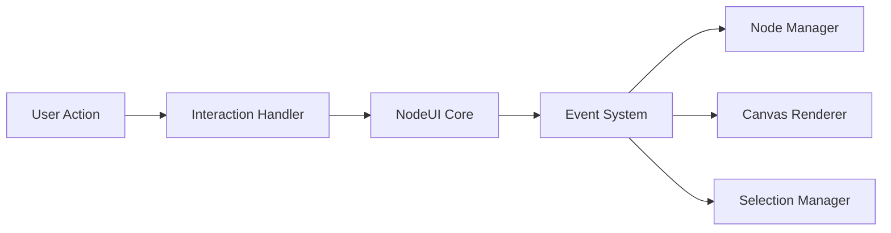

# System Patterns

## Architecture Overview

### Core Components

## Design Patterns

### Handler Pattern
1. **Specialized Handler Classes**
   - Each handler has a focused responsibility
   - Clean separation of concerns
   - Delegation pattern for method calls
   - Maintains single responsibility principle

2. **Handler Communication**
   - Handlers communicate through NodeUI orchestration
   - Event system for cross-handler communication
   - Shared state managed by NodeUI core
   - Clean interfaces between handlers

### Node System
1. **Base Node Pattern**
   - Abstract base class for all nodes
   - Common functionality implementation
   - Extension points for specific node types

2. **Node Type System**
   - Inheritance-based node type hierarchy
   - Specialized node implementations
   - Type-specific properties and behaviors

### Event System
1. **Observer Pattern**
   - Event emission and subscription
   - Decoupled component communication
   - Centralized event handling

2. **Command Pattern**
   - Action encapsulation
   - Undo/redo support
   - Operation history

### UI Components
1. **Context Menu System**
   - Dynamic menu generation
   - Context-sensitive options
   - Action delegation

2. **Properties Panel**
   - Dynamic property rendering
   - Type-specific editors
   - Real-time updates

## Component Relationships

### Handler Hierarchy

### Node Hierarchy

### Event Flow

## Technical Decisions

### JavaScript Architecture
1. **Handler Pattern**
   - Focused responsibility classes
   - Clean separation of concerns
   - Maintainable and testable code
   - Extensible architecture

2. **Event-Driven Architecture**
   - Loose coupling between components
   - Reactive updates
   - State synchronization

### State Management
1. **Centralized State**
   - NodeUI core manages shared state
   - Handlers access state through NodeUI
   - Clean state boundaries

2. **Handler State**
   - Each handler manages its own internal state
   - State isolation prevents conflicts
   - Clear state ownership

### Data Persistence
1. **Local Storage**
   - Graph state serialization
   - Configuration storage
   - Session management

## Implementation Guidelines

### Code Organization
1. **File Structure**
   - One handler per file
   - Clear dependency hierarchy
   - Logical grouping

2. **Naming Conventions**
   - Descriptive function names
   - Clear variable naming
   - Consistent patterns

### Performance Considerations
1. **Rendering Optimization**
   - Efficient DOM updates
   - Canvas rendering where appropriate
   - Event debouncing

2. **Memory Management**
   - Proper event cleanup
   - Resource disposal
   - Reference management

### Handler Guidelines
1. **Single Responsibility**
   - Each handler has one clear purpose
   - Avoid mixing concerns
   - Keep handlers focused

2. **Clean Interfaces**
   - Clear public methods
   - Minimal coupling
   - Well-defined contracts

3. **State Management**
   - Handlers don't directly modify other handlers' state
   - Use events for cross-handler communication
   - Maintain clear state boundaries 