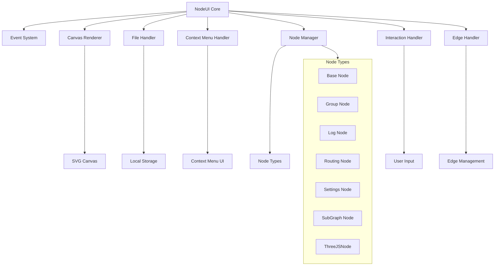
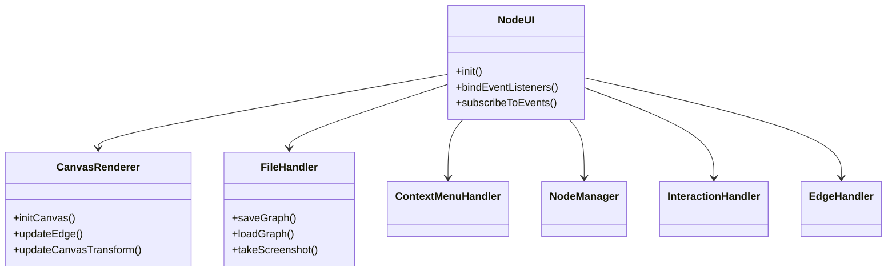
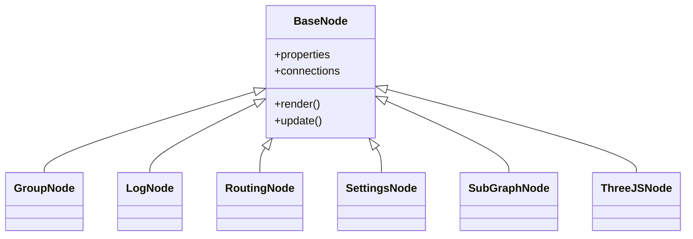
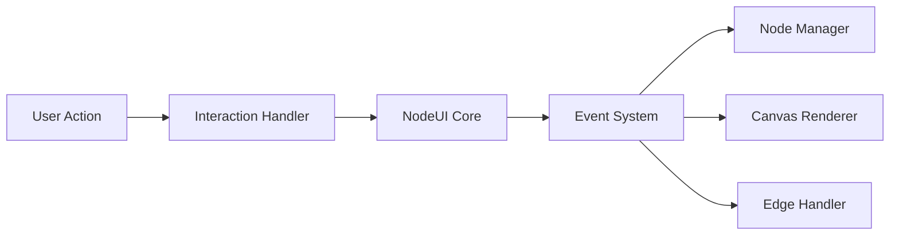

# System Patterns

## Architecture Overview

### Core Components


## Design Patterns

### Handler Pattern
1. **Specialized Handler Classes**
   - Each handler has a focused responsibility
   - Clean separation of concerns
   - Delegation pattern for method calls
   - Maintains single responsibility principle

2. **Handler Communication**
   - Handlers communicate through NodeUI orchestration
   - Event system for cross-handler communication
   - Shared state managed by NodeUI core
   - Clean interfaces between handlers

### Node System
1. **Base Node Pattern**
   - Abstract base class for all nodes
   - Common functionality implementation
   - Extension points for specific node types

2. **Node Type System**
   - Inheritance-based node type hierarchy
   - Specialized node implementations
   - Type-specific properties and behaviors

### Event System
1. **Observer Pattern**
   - Event emission and subscription
   - Decoupled component communication
   - Centralized event handling

2. **Command Pattern**
   - Action encapsulation
   - Undo/redo support
   - Operation history

### UI Components
1. **Context Menu System**
   - Dynamic menu generation
   - Context-sensitive options
   - Action delegation

2. **Properties Panel**
   - Dynamic property rendering
   - Type-specific editors
   - Real-time updates

## Component Relationships

### Handler Hierarchy


### Node Hierarchy


### Event Flow


## System Patterns
- **Graph Context Stack**: A stack (`graphContext.graphStack`) is used to manage navigation between the main graph and nested subgraphs. Entering a subgraph pushes its context onto the stack, and exiting pops it. This ensures a clear hierarchy and enables breadcrumb navigation.
- **State Serialization**: When navigating between contexts, the current graph state is serialized into a deep-copied JSON object. This prevents state corruption and ensures that changes within a subgraph are isolated until explicitly saved to the parent.
- **Conditional Animation Loops**: Animation loops are only active when needed (during user interaction or timeline playback) to conserve resources and prevent unnecessary rendering.
- **Render State Optimization**: Intelligent tracking of render state prevents unnecessary WebGL render calls when the 3D scene is static, significantly improving performance.
- **GPU Acceleration Patterns**: CSS optimizations and WebGL configurations are used to leverage hardware acceleration for smooth 3D rendering performance.
- **Direct State Push for Specialized Nodes**: This pattern is used for updating the `ThreeJSNode` based on graph topology, allowing for dynamic and responsive 3D rendering.

## Technical Decisions

### JavaScript Architecture
1. **Handler Pattern**
   - Focused responsibility classes
   - Clean separation of concerns
   - Maintainable and testable code
   - Extensible architecture

2. **Event-Driven Architecture**
   - Loose coupling between components
   - Reactive updates
   - State synchronization

### State Management
1. **Centralized State**
   - NodeUI core manages shared state
   - Handlers access state through NodeUI
   - Clean state boundaries

2. **Handler State**
   - Each handler manages its own internal state
   - State isolation prevents conflicts
   - Clear state ownership

### Data Persistence
1. **Local Storage**
   - Graph state serialization
   - Configuration storage
   - Session management

## Implementation Guidelines

### Code Organization
1. **File Structure**
   - One handler per file
   - Clear dependency hierarchy
   - Logical grouping

2. **Naming Conventions**
   - Descriptive function names
   - Clear variable naming
   - Consistent patterns

### Performance Considerations
1. **Rendering Optimization**
   - Efficient DOM updates
   - Canvas rendering where appropriate
   - Event debouncing

2. **Memory Management**
   - Proper event cleanup
   - Resource disposal
   - Reference management

### Handler Guidelines
1. **Single Responsibility**
   - Each handler has one clear purpose
   - Focused functionality
   - Clean interfaces

2. **Event Communication**
   - Use events for cross-handler communication
   - Avoid direct handler-to-handler calls
   - Maintain loose coupling

3. **State Management**
   - Handlers manage their own internal state
   - Shared state goes through NodeUI core
   - Clear state boundaries

## Current File Structure
```
src/
├── core/
│   ├── main.js           # NodeUI core orchestration
│   ├── canvas.js         # Canvas rendering and SVG operations
│   ├── file.js           # File operations and persistence
│   ├── contextMenu.js    # Context menu management
│   ├── nodes.js          # Node lifecycle management
│   ├── interactions.js   # User input handling and interactions
│   ├── edges.js          # Edge drawing and routing
│   └── events.js         # Event system
├── nodes/
│   ├── basenode.js       # Base node class
│   ├── baseedge.js       # Base edge class
│   ├── groupnode.js      # Group node implementation
│   ├── lognode.js        # Log node implementation
│   ├── routingnode.js    # Routing node implementation
│   ├── settingsnode.js   # Settings node implementation
│   ├── subgraphnode.js   # SubGraph node implementation
│   └── threejsnode.js    # 3D Viewport node implementation
└── styles/
    ├── styles.css        # Global styles
    ├── variables.css     # CSS variables
    ├── icons.css         # Icon styles
    └── components.css    # Component styles
``` 