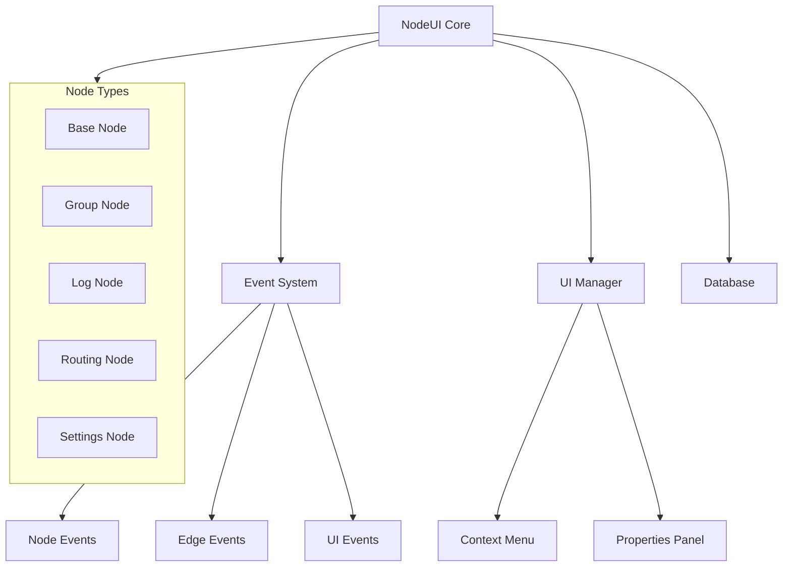
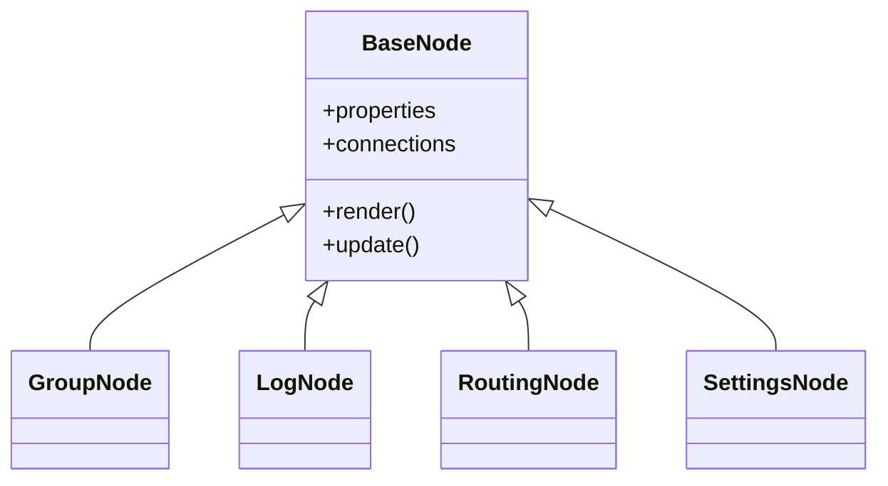
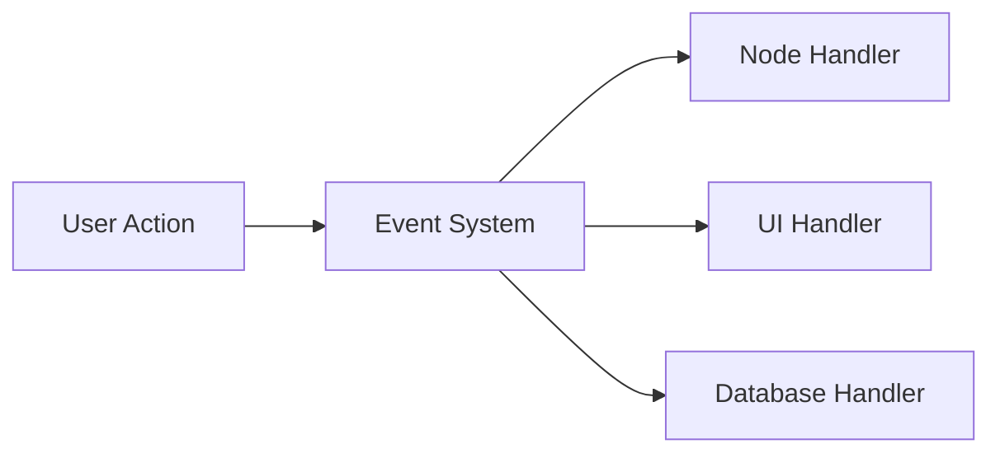

# System Patterns

## Architecture Overview

### Core Components

## Design Patterns

### Node System
1. **Base Node Pattern**
   - Abstract base class for all nodes
   - Common functionality implementation
   - Extension points for specific node types

2. **Node Type System**
   - Inheritance-based node type hierarchy
   - Specialized node implementations
   - Type-specific properties and behaviors

### Event System
1. **Observer Pattern**
   - Event emission and subscription
   - Decoupled component communication
   - Centralized event handling

2. **Command Pattern**
   - Action encapsulation
   - Undo/redo support
   - Operation history

### UI Components
1. **Context Menu System**
   - Dynamic menu generation
   - Context-sensitive options
   - Action delegation

2. **Properties Panel**
   - Dynamic property rendering
   - Type-specific editors
   - Real-time updates

## Component Relationships

### Node Hierarchy

### Event Flow

## Technical Decisions

### JavaScript Architecture
1. **Module Pattern**
   - Clear separation of concerns
   - Encapsulated functionality
   - Controlled public interfaces

2. **Event-Driven Architecture**
   - Loose coupling between components
   - Reactive updates
   - State synchronization

### State Management
1. **Graph State**
   - Node positions and connections
   - Property values
   - Selection state

2. **UI State**
   - Active tools
   - Menu states
   - Panel visibility

### Data Persistence
1. **Local Storage**
   - Graph state serialization
   - Configuration storage
   - Session management

## Implementation Guidelines

### Code Organization
1. **File Structure**
   - Modular component files
   - Clear dependency hierarchy
   - Logical grouping

2. **Naming Conventions**
   - Descriptive function names
   - Clear variable naming
   - Consistent patterns

### Performance Considerations
1. **Rendering Optimization**
   - Efficient DOM updates
   - Canvas rendering where appropriate
   - Event debouncing

2. **Memory Management**
   - Proper event cleanup
   - Resource disposal
   - Reference management 