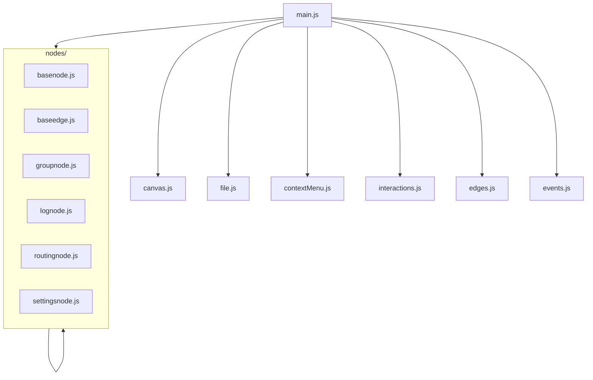

# Technical Context

## Technology Stack

### Core Technologies
- HTML5
- CSS3
- Vanilla JavaScript (ES6+)

### Browser Features Used
1. **DOM API**
   - Element manipulation
   - Event handling
   - DOM traversal

2. **Canvas API**
   - Node rendering
   - Connection visualization
   - Interactive graphics

3. **Local Storage API**
   - Graph state persistence
   - Configuration storage
   - Session management

## Development Setup

### Project Structure
```
NodeUI/
  ├── index.html          # Main entry point
  ├── src/                # Source code
  │   ├── styles/        # Stylesheets
  │   │   ├── styles.css # Global styles
  │   │   ├── variables.css # CSS variables
  │   │   ├── icons.css # Icon styles
  │   │   ├── components.css # Component styles
  │   ├── core/          # Core system modules
  │   │   ├── main.js           # Core application orchestration
  │   │   ├── canvas.js         # Canvas rendering and SVG operations
  │   │   ├── file.js           # File operations and persistence
  │   │   ├── contextMenu.js    # Context menu management
  │   │   ├── nodes.js          # Node and edge lifecycle management
  │   │   ├── interactions.js   # User input handling and interactions
  │   │   ├── edges.js          # Edge drawing and routing
  │   │   └── events.js         # Event system
  │   └── nodes/           # Node implementations
  │       ├── basenode.js
  │       ├── baseedge.js
  │       ├── groupnode.js
  │       ├── lognode.js
  │       ├── routingnode.js
  │       └── settingsnode.js
  └── graph.json         # Graph state storage
```

### Module Dependencies


## Technical Constraints

### Browser Compatibility
- Modern evergreen browsers
- ES6+ JavaScript support
- HTML5 Canvas support
- Local Storage availability

### Performance Requirements
1. **Rendering**
   - Smooth node movement
   - Responsive edge updates
   - Efficient property updates

2. **State Management**
   - Quick save/load operations
   - Responsive UI updates
   - Efficient event handling

3. **Memory Usage**
   - Proper resource cleanup
   - Optimized data structures
   - Event listener management

### Security Considerations
1. **Data Storage**
   - Local storage limitations
   - Data validation
   - Safe serialization

2. **User Input**
   - Input sanitization
   - XSS prevention
   - Safe event handling

## Dependencies

### External Resources
- No external JavaScript libraries
- No CSS frameworks
- No build tools required

### Browser APIs
1. **Required APIs**
   - DOM Manipulation
   - Canvas 2D Context
   - Local Storage
   - JSON parsing/stringifying

2. **Optional APIs**
   - Pointer Events
   - ResizeObserver
   - requestAnimationFrame

## Development Guidelines

### Code Standards
1. **JavaScript**
   - ES6+ features
   - Handler pattern for separation of concerns
   - Clear documentation
   - Consistent naming

2. **HTML/CSS**
   - Semantic markup
   - BEM methodology
   - Responsive design
   - Performance-focused

### Architecture Guidelines
1. **Handler Pattern**
   - Each handler has a single responsibility
   - Clean interfaces between handlers
   - Delegation pattern for method calls
   - Event-driven communication

2. **State Management**
   - Centralized state in NodeUI core
   - Handler-specific state isolation
   - Clear state boundaries
   - Event-based state updates

### Testing Requirements
1. **Browser Testing**
   - Chrome
   - Firefox
   - Safari
   - Edge

2. **Feature Testing**
   - Node operations
   - Edge management
   - State persistence
   - Event handling
   - Handler interactions 