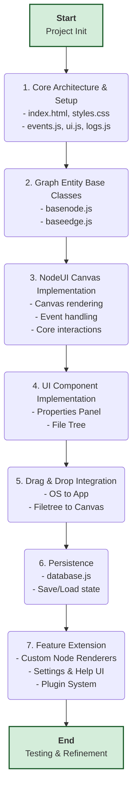

# NodeUI Development Workflow

This document outlines the ordered workflow for building the NodeUI application, expanding on the tasks defined in `tasks.md`.

**Note on Checkpoints:** After each major numbered step in this workflow is completed, a `git` checkpoint will be created. This ensures a clean, atomic commit history for the project.

## Workflow Diagram

## Detailed Workflow Steps

### 1. Core Architecture & Setup

This initial phase lays the groundwork for the entire application.
-   **`index.html`**: Create the main HTML file with a responsive viewport meta tag and the necessary `div` elements for UI panels.
-   **`styles.css`**: Implement the base theme using a **mobile-first** approach. Define CSS variables and use responsive units (rem, em, %) and media queries to ensure the layout adapts to all screen sizes.
-   **`js/events.js`**: This is the most critical file in this phase. Implement a simple but robust Publish/Subscribe event bus. It should have `subscribe(eventName, callback)` and `publish(eventName, data)` methods.
-   **`js/ui.js`**: Create a library of shared, pure UI functions. For example, a function that creates a standardized button with an icon, or one that generates a context menu from a list of options. This avoids duplicating UI code across modules.
-   **`js/logs.js`**: A simple logging service that subscribes to all events (`*`) on the event bus. During development, this will print every action to the console, providing an invaluable, real-time trace of what's happening in the application.

### 2. Graph Entity Base Classes

This phase defines the data models for the core objects in our application.
-   **`js/graph/basenode.js`**: Create the `BaseNode` class. It will manage properties common to all nodes: `id`, `x`, `y`, `width`, `height`, `title`, and `content` (the markdown string). It will also contain the logic for rendering the node's container, title bar, and connection handles. It will *not* contain logic for rendering the specific content.
-   **`js/graph/baseedge.js`**: Create the `BaseEdge` class. It will manage properties common to all edges: `id`, `startNodeId`, `endNodeId`, `startHandle`, `endHandle`, and visual properties like `color` and `style`. It will contain the logic to draw and update its SVG path on the canvas.

### 3. NodeUI Canvas Implementation

This is where the application becomes interactive.
-   **`js/nodeui.js`**: This module will manage the main SVG canvas.
-   **Event Subscriptions**: It will subscribe to events like `node:create`, `edge:delete`, etc., and update its internal state and the DOM accordingly.
-   **User Interaction**: It must handle both **mouse and touch events** for all interactions: panning, zooming, drag-selection, dragging nodes (publishing `node:moved` events), and creating edges (publishing `edge:created` events). Context menus should be implemented to work on both right-click and long-press.
-   **Visuals**: It will implement the rendering for the dotted background grid and the logic for snapping nodes/edges to the grid or to other objects.

### Completed: Checkpoint 3 - NodeUI Canvas Implementation
*   **Status:** All tasks under this checkpoint are complete and verified.
*   **Summary:** The `NodeUI` class in `js/nodeui.js` now manages the entire canvas. It handles all user interactions for both mouse and touch, including panning (with grab/grabbing cursors), zooming, node dragging, edge drawing, and multi-selection. It implements advanced features like a right-click/long-press context menu, snap-to-grid/object, a "cut edge" mode, and full clipboard (cut/copy/paste) functionality. All state changes are communicated via the central event bus. The system is now a fully interactive graph editor.

### 4. UI Component Implementation

With the core graph working, we build the panels that interact with it. All panels must be designed to be collapsible or dockable for use on small screens.
-   **`js/properties.js`**: This module creates and manages the properties panel. It subscribes to `selection:changed` events. When it receives an event, it clears its current content and displays the relevant properties for the selected node or edge. When a user changes a value (e.g., a node's title), this module publishes an update event (e.g., `node:updated`).
-   **`js/filetree.js`**: This module manages the file tree panel. It will render the tree structure and handle UI interactions like expanding/collapsing folders. When the user performs an action like renaming a file, it will publish an event like `file:renamed`.

### 5. Drag & Drop Integration

This phase connects the desktop and the file tree to the main canvas.
-   Implement event listeners for the `drop` event on the file tree and the main canvas.
-   When a file is dropped from the operating system, read the file data and publish an appropriate event (e.g., `file:droppedOnFileTree` or `node:createWithFile`).
-   When a file is dragged from the file tree onto the canvas, publish a `node:createWithFile` event containing the file's information.

### 6. Persistence

This makes the user's work permanent.
-   **`js/database.js`**: This module will encapsulate all IndexedDB logic.
-   **Saving**: It will subscribe to all events that represent a change in state (`node:*`, `edge:*`, `file:*`, etc.) and save the updated data to the database. It can be optimized to batch updates.
-   **Loading**: On application startup, it will read all the data from IndexedDB and publish a series of `*:create` events to populate the graph and file tree, restoring the application to its last saved state.

### 7. Feature Extension

With the core system in place, we can now easily add higher-level features.
-   **Custom Node Renderers**: Create the specialized node classes in `js/nodes/`. These classes will extend `BaseNode` and implement their own `renderContent()` method. The `nodeui.js` module will be updated to act as a factory, choosing which renderer to use based on a node's `type` property.
-   **Settings & Help**: Build the UI for the settings and help menus. These modules will publish `setting:changed` events that other modules (like `styles.css` or `nodeui.js`) can subscribe to in order to apply the new settings.
-   **Plugin System**: Implement a simple plugin manager that can dynamically enable or disable custom node renderers, controlled by the settings UI.

### 8. Testing & Refinement

The final phase involves thorough testing of all features, fixing bugs, and refining the user experience. This includes checking for performance issues, ensuring cross-browser compatibility on **both desktop and mobile**, and polishing CSS animations and transitions. 